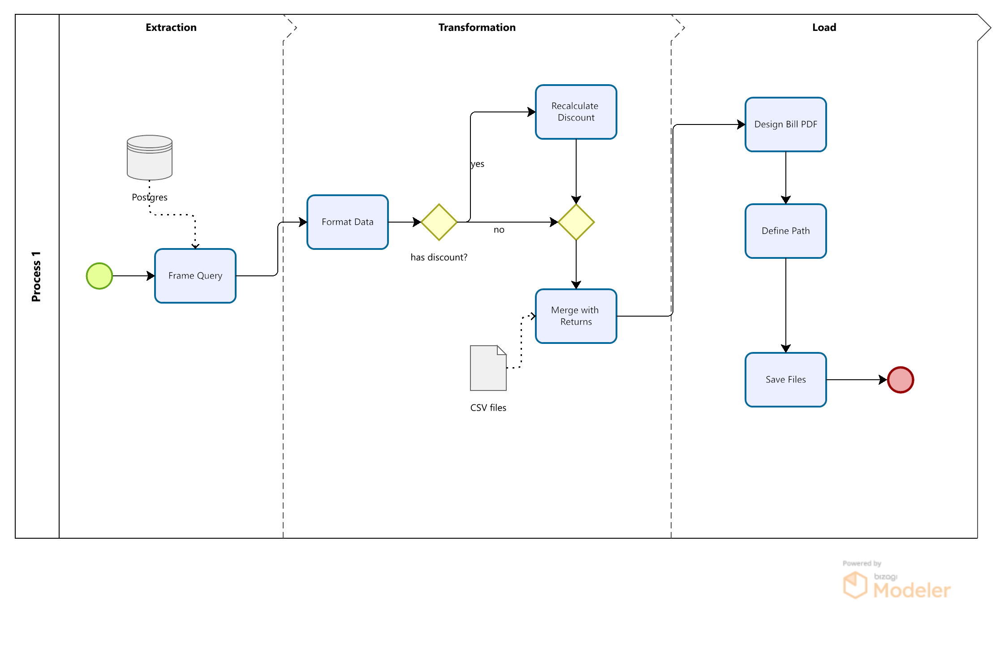
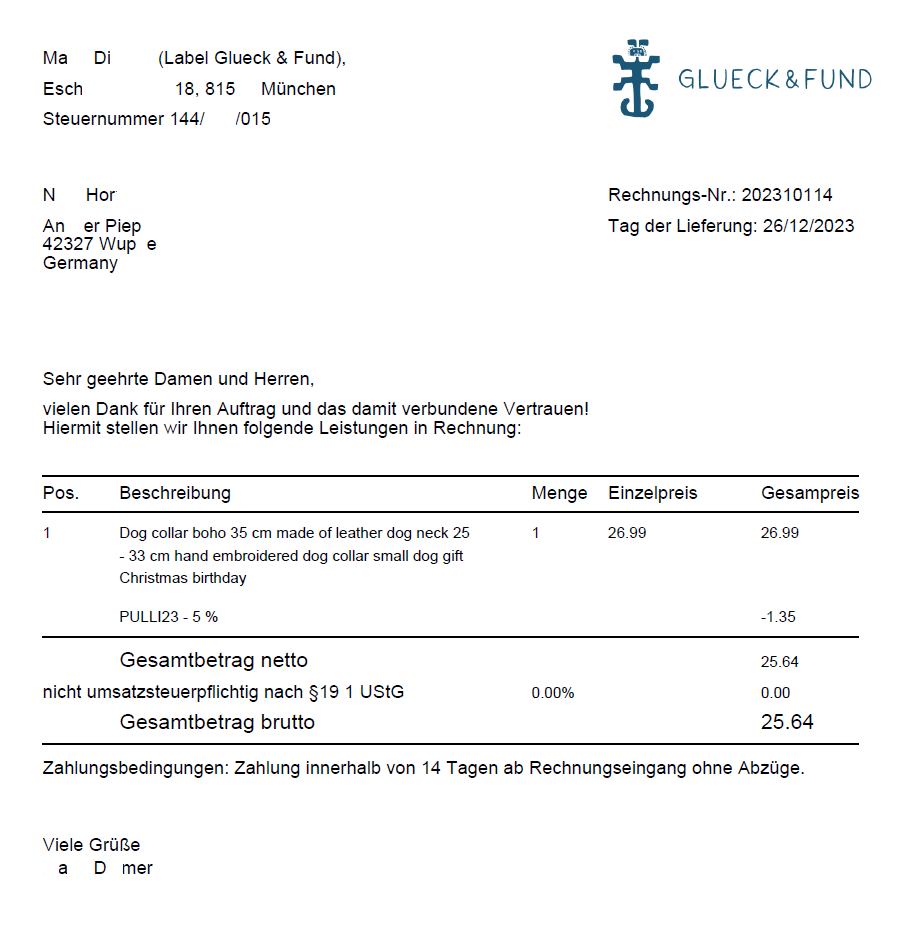

# Billing Generator
> The script reads, transforms and loads information from dataframe into unique PDF files to generate a detailed bill-form document.

[![postgres][postgres-badge]][postgres-link][![python][python-badge]][python-link][![jupyter][jupyter-badge]][jupyter-link][![vsc][vsc-badge]][vsc-link]

The following diagram douments the process run by the script to generate the final bill.

## Usage example

The script generates a bill document per row in the table. Sample of the billing design.

## Development setup

Main libraries in main script:

1. [![pandas][python-pandas-badge]][python-pandas-url], for data transformation
2. [![psycopg2][python-psycopg2-badge]][python-psycopg2-url], for connecting with PostgresSQL
3. [![base64][python-base64-badge]][python-base64-url], for designing the PDF

## Contributing

1.  [![Linkedin][linkedin-badge]][linkedin-url]

<!-- Markdown link & img dfn's -->
[python-pandas-badge]: https://img.shields.io/badge/python-pandas-blue
[python-pandas-url]: https://pypi.org/project/pandas/
[python-psycopg2-badge]:https://img.shields.io/badge/python-psycopg2-green
[python-psycopg2-url]: https://pypi.org/project/psycopg/
[python-base64-badge]: https://img.shields.io/badge/python-base64-yellow
[python-base64-url]: https://pypi.org/project/pybase64/
[linkedin-badge]:https://img.shields.io/badge/LinkedIn-0077B5?style=for-the-badge&logo=linkedin&logoColor=white
[linkedin-url]:https://www.linkedin.com/in/berlangas/
[postgres-badge]:https://img.shields.io/badge/PostgreSQL-316192?style=for-the-badge&logo=postgresql&logoColor=white
[postgres-link]:https://www.postgresql.org/
[python-badge]:https://img.shields.io/badge/Python-FFD43B?style=for-the-badge&logo=python&logoColor=blue
[python-link]:https://www.python.org/
[jupyter-badge]:https://img.shields.io/badge/Jupyter-F37626.svg?&style=for-the-badge&logo=Jupyter&logoColor=white
[jupyter-link]:https://jupyter.org/
[vsc-badge]:https://img.shields.io/badge/VSCode-0078D4?style=for-the-badge&logo=visual%20studio%20code&logoColor=white
[vsc-link]:https://code.visualstudio.com/
